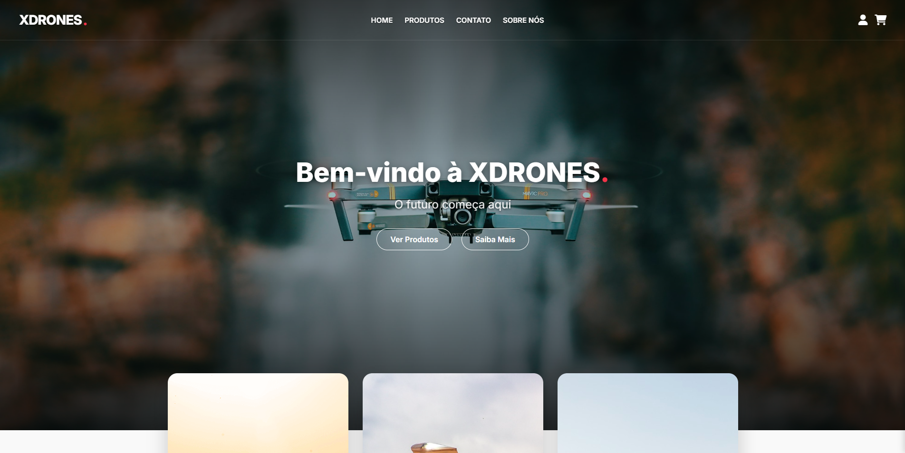
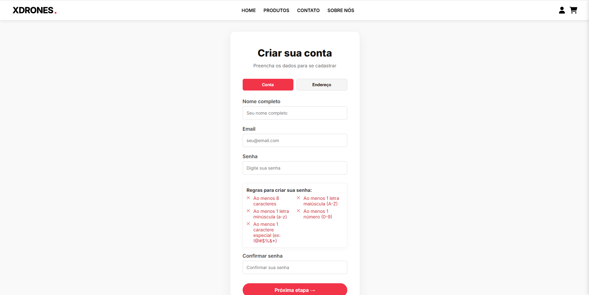
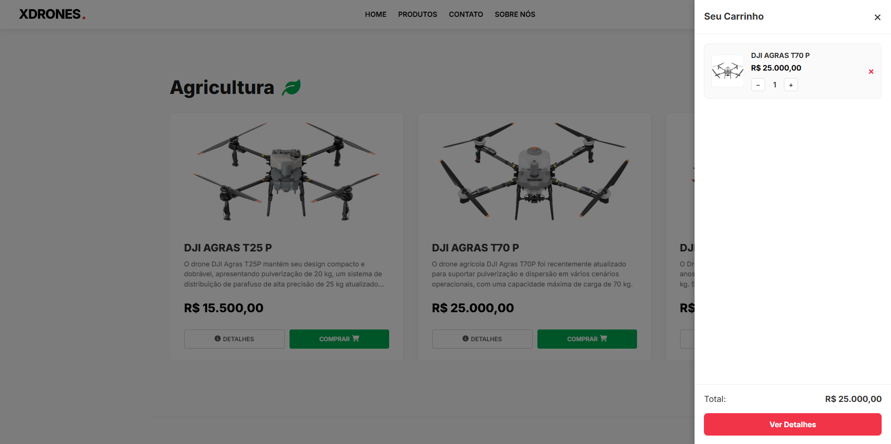
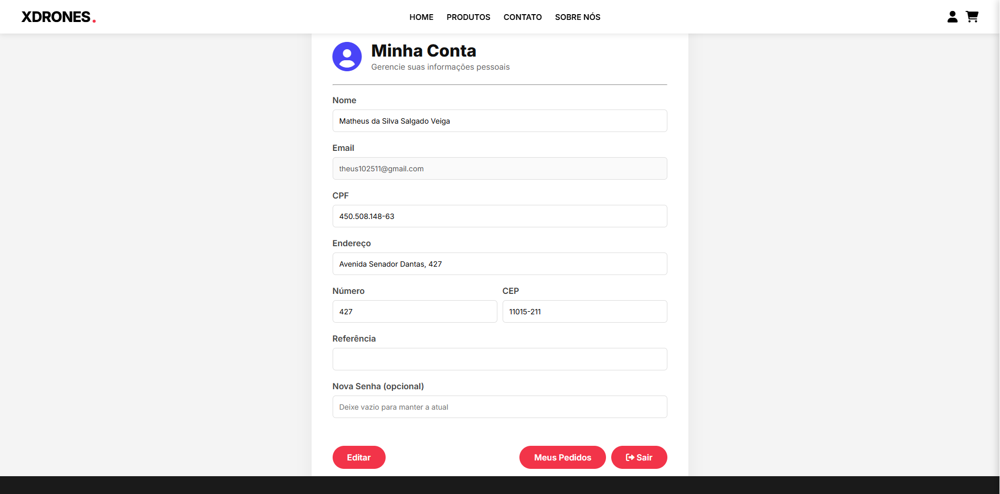
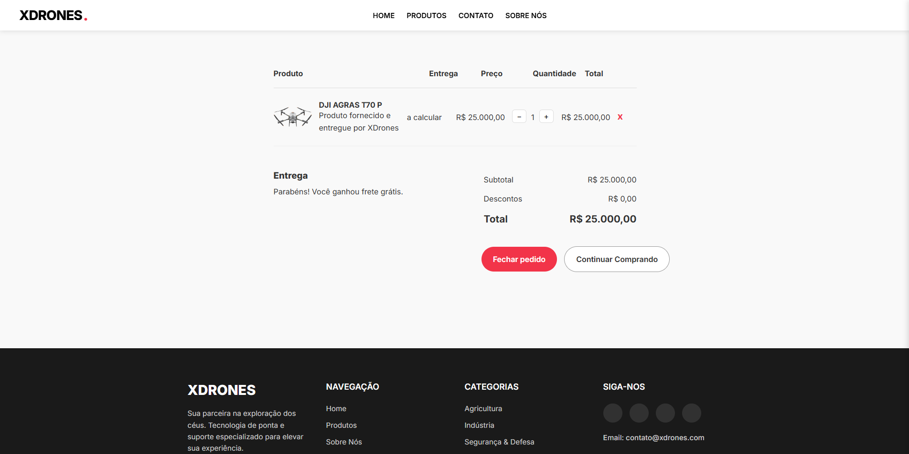
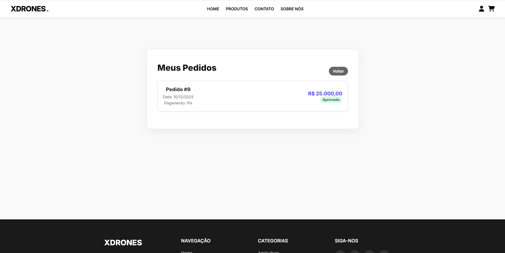

# 🚁 XDRONES: Plataforma E-commerce de Drones Profissionais

## 🚀 Visão Geral do Projeto

O **XDrones** é uma solução de e-commerce completa, desenvolvida como um projeto educacional, focada na venda e gestão de drones profissionais (Agricultura, Indústria e Segurança). O projeto segue o padrão *Client-Server*, utilizando **ASP.NET Core (C#)** para o Backend API e **HTML/CSS/JavaScript puro** para o Frontend.

O foco principal do desenvolvimento foi a implementação de um sistema de autenticação robusto e uma forte camada de regras de negócio (*Business Layer*) para garantir a integridade dos dados e a segurança dos usuários.

## 👥 Membros da Equipe

Este projeto foi desenvolvido por:

* **Thiago Pinheiro dos Santos**
* **Matheus da Silva Salgado Veiga**
* **Rennan Miranda Rodrigues Gonçalves dos Santos Leite**
* **João Victor de Oliveira Macedo**
* **Roniel Santana Faria**

---

## 🖼️ Demonstração Visual

Veja a seguir os principais componentes da interface e as funcionalidades implementadas.

| Funcionalidade | Print |
| :--- | :--- |
| **Página Inicial** |  |
| **Formulário de Cadastro** |  |
| **Vitrine** |  |
| **Página Minha Conta (Perfil)** |  |
| **Finalizar Compra (Checkout)** |  |
| **Pedido Concluido** |  |

---

## ⚙️ Tecnologias Utilizadas

| Camada | Tecnologia | Componentes Principais |
| :--- | :--- | :--- |
| **Backend (API)** | ASP.NET Core 7/8 (C#) | Controllers (API REST), Entity Framework Core (ORM) |
| **Banco de Dados** | **MySQL** | Sistema de Gerenciamento de Banco de Dados Relacional (SGBDR) |
| **Segurança** | **JWT (JSON Web Tokens)** | Autenticação baseada em tokens. |
| **Criptografia** | **BCrypt** | Hashing de senhas para garantir segurança e impedir visualização. |
| **Frontend** | HTML5, CSS3, JavaScript (ES6+) | Consumo da API via `fetch`, lógica de carrinho (LocalStorage), UI responsiva. |

## 🔒 Destaques de Segurança e Regras de Negócio

O projeto XDrones utiliza uma forte Camada de Negócios (BLL - Business Logic Layer) no Backend para garantir a segurança e a integridade dos dados.

### 1. Autenticação e Autorização Segura

* **Implementação de JWT (JSON Web Tokens):** Token emitido após o login para autenticar todas as requisições protegidas.
* **Criptografia BCrypt:** Utilizada para fazer o *hash* e armazenar senhas de forma segura.

### 2. Camada de Negócios (Validação Rigorosa)

* **Validação de Senhas Fortes:** Exige senhas com **no mínimo 8 caracteres**, incluindo letras maiúsculas, minúsculas, números e caracteres especiais.
* **Validação de E-mail:** Verificação de formato de e-mail válido.
* **Validação de CPF:** Verificação da validade estrutural do CPF, incluindo o cálculo do dígito verificador.

## 🗺️ Estrutura da API REST

A API expõe os seguintes *endpoints* essenciais:

| Módulo | Endpoint Base | Método | Descrição |
| :--- | :--- | :--- | :--- |
| **Autenticação** | `/api/Auth/register` | `POST` | Cria um novo usuário (com validações de negócio). |
| **Autenticação** | `/api/Auth/login` | `POST` | Autentica o usuário e retorna o JWT. |
| **Produtos** | `/api/Produtos` | `GET` | Lista todos os drones disponíveis na loja. |
| **Pedidos** | `/api/Pedidos` | `POST` | Finaliza uma compra, registrando o pedido no banco. **(Requer JWT)** |
| **Pedidos** | `/api/Pedidos/usuario/{id}` | `GET` | Lista os pedidos de um usuário específico. **(Requer JWT)** |

## 🛠️ Como Executar o Projeto

### Requisitos

* .NET SDK (Versão 7 ou superior)
* Servidor **MySQL** (com *connection string* configurada).

### Backend (API C#)

1.  Navegue até a pasta `Backend`.
2.  **Criação das Tabelas:** Rode o script SQL que recria o banco de dados e insere dados iniciais (ou utilize `dotnet ef database update` se as migrations estiverem configuradas).
3.  **Executar:**
    ```bash
    dotnet run
    ```
    O Swagger (documentação da API) pode ser acessado no endereço `/swagger` (ex: `https://localhost:7155/swagger`).

### Frontend (Website HTML/JS)

1.  Navegue até a pasta `FrontEnd`.
2.  Abra o arquivo `index.html` ou use uma extensão como o Live Server (VS Code).
3.  **Ajuste da API:** Confirme se as constantes `API_URL` nos arquivos JavaScript (como `checkout.js` e `cadastro.js`) estão apontando para a URL correta do seu Codespaces (geralmente a porta 7155 exposta).
